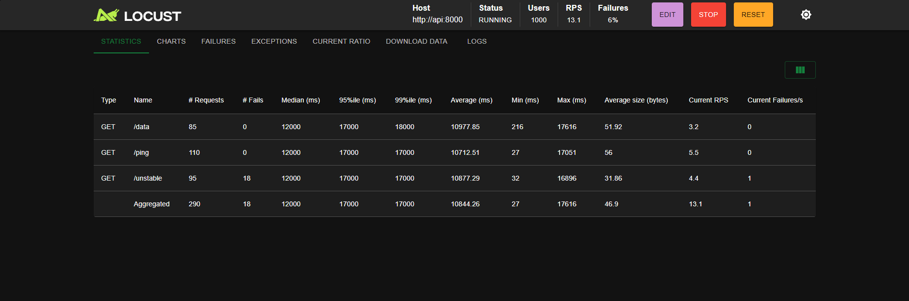
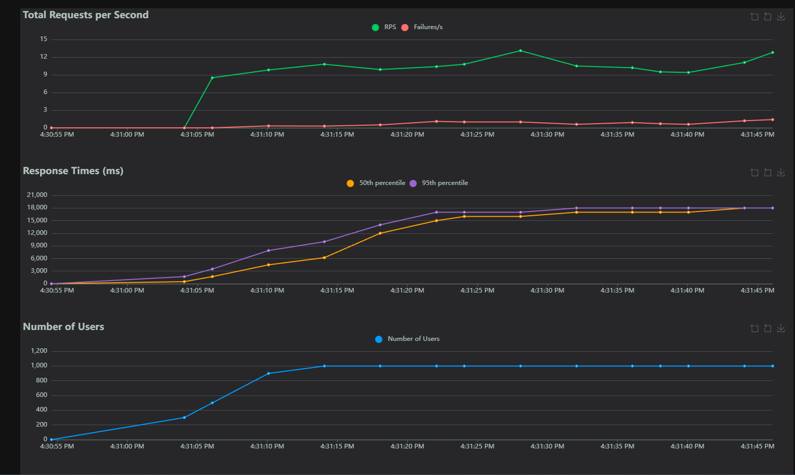

# 🚀 Network Service Load & Reliability Testing Framework

[](https://www.python.org/)
[](https://fastapi.tiangolo.com/)
[](https://www.docker.com/)

> **Production-ready REST API testing framework demonstrating FastAPI, SQLite, Docker, and comprehensive testing automation. Features health checks, load testing with Locust, pytest integration, and performance monitoring.**

## 📋 Table of Contents
- [Overview](#overview)
- [Features](#features)
- [Architecture](#architecture)
- [Quick Start](#quick-start)
- [API Endpoints](#api-endpoints)
- [Testing](#testing)
- [Fault Injection](#fault-injection)
- [Performance Dashboard](#performance-dashboard)
- [CI/CD Integration](#cicd-integration)
- [Project Structure](#project-structure)

---

## 🎯 Overview





This project demonstrates professional-grade API testing and automation capabilities:

✅ **FastAPI REST API** with multiple endpoints  
✅ **Automated Load Testing** with Locust  
✅ **SQLite Database** with SQLAlchemy ORM  
✅ **Comprehensive Test Suite** with pytest (18+ tests)  
✅ **Performance Dashboard** (HTML-based)  
✅ **Network Packet Testing** with Scapy  
✅ **Docker Containerization** with optimize Dockerfile  
✅ **CI/CD Ready** with GitHub Actions

**Perfect for demonstrating SDET/QA/Network Engineering skills on resumes!**

---

## ✨ Features

### 🔧 Core Functionality
- **FastAPI REST API** with health checks, authentication, and data endpoints
- **Automatic metrics collection** for every request
- **SQLite/PostgreSQL** database for persistent storage
- **Async request handling** for high performance

### 📊 Monitoring & Analytics
- **Performance dashboard** with endpoint status
- **Metrics endpoints** for response time tracking
- **Health check** with feature dashboard
- **Request logging** to SQLite database
- **Per-endpoint statistics** API

### 💥 Fault Injection (Configurable)
- **Fault injection endpoints** for enabling/disabling
- **Fault logging** to database
- **Configurable parameters** (latency, error rate, timeouts)
- **Status and log endpoints** for monitoring
- Ready for chaos engineering integration

### 🧪 Testing Capabilities
- **18+ functional tests** with pytest
- **Load testing** with Locust integration
- **Network packet testing** with Scapy
- **Concurrent request testing**
- **HTML report generation** for test results

### 📈 Visualization & Reporting
- HTML performance dashboard
- Test result HTML reports
- Metric summary endpoints (JSON API)
- Per-endpoint statistics API
- Database-backed metrics storage

---

## 🏗 Architecture

```
┌─────────────┐     ┌──────────────┐     ┌─────────────┐
│   Client    │────▶│  FastAPI API │────▶│  Database   │
│  (Tests/UI) │     │   (Python)   │     │  (SQLite)   │
└─────────────┘     └──────────────┘     └─────────────┘
                           │
                           ▼
                    ┌──────────────┐
                    │   Metrics    │
                    │  Middleware  │
                    └──────────────┘
                           │
                           ▼
                    ┌──────────────┐
                    │ Visualization│
                    │   Charts     │
                    └──────────────┘
```

**Components:**
1. **API Layer**: FastAPI with 12+ async endpoints
2. **Database**: SQLAlchemy ORM with SQLite (upgradeable to PostgreSQL)
3. **Testing**: pytest (18 tests) + Locust + Scapy
4. **Deployment**: Docker + docker-compose orchestration
5. **Monitoring**: Metrics API endpoints + dashboard
6. **CI/CD**: GitHub Actions automated testing workflow

---

## 🚀 Quick Start

### Prerequisites
- Python 3.13+
- Docker (optional, for containerized deployment)
- Admin/root privileges (optional, for Scapy network testing)

### Installation & Running

#### Option 1: Direct (Fastest)
```bash
# Navigate to project
cd Network-Service-Load-Testing-Framework

# Create virtual environment (if not already created)
python -m venv .venv
.venv\Scripts\activate  # Windows
# source .venv/bin/activate  # Linux/Mac

# Install dependencies
pip install -r requirements.txt

# Run the API
uvicorn app.main:app --reload
```
✅ API runs at **http://localhost:8000**

#### Option 2: Docker Compose (Production)
```bash
# Build and run with docker-compose
docker-compose up
```
✅ API runs at **http://localhost:8000**

#### Option 3: Docker Only
```bash
# Build image
docker build -t network-api .

# Run container  
docker run -p 8000:8000 network-api
```

### Access the Application
| URL | Purpose |
|-----|----------|
| http://localhost:8000/docs | **Interactive API Documentation** (Swagger UI) |
| http://localhost:8000/dashboard | **Performance Dashboard** (HTML) |
| http://localhost:8000/metrics/summary | **Metrics Summary** (JSON API) |
| http://localhost:8000/health | **Health Check** (JSON) |
| http://localhost:8089 | **Locust** (load testing UI, if docker-compose) |

---

## 📡 API Endpoints

### Core Endpoints
| Method | Endpoint | Description |
|--------|----------|-------------|
| GET | `/ping` | Health check |
| POST | `/login` | Authentication |
| GET | `/data` | Data retrieval (variable latency) |
| GET | `/unstable` | Random failures for testing |
| GET | `/health` | Comprehensive health check |

### Metrics Endpoints
| Method | Endpoint | Description |
|--------|----------|-------------|
| GET | `/metrics/summary` | Aggregated metrics summary |
| GET | `/metrics/endpoints` | Per-endpoint performance stats |
| GET | `/dashboard` | Interactive performance dashboard |
| DELETE | `/metrics/clear` | Clear all metrics (admin) |

### Fault Injection Endpoints
| Method | Endpoint | Description |
|--------|----------|-------------|
| POST | `/fault-injection/enable` | Enable fault injection |
| POST | `/fault-injection/disable` | Disable fault injection |
| GET | `/fault-injection/status` | Get fault injection config |
| GET | `/fault-injection/logs` | View fault injection logs |

---

## 🧪 Testing

### Run Functional Tests (pytest)
```bash
# Run all tests
pytest tests/ -v

# Run specific test
pytest tests/test_api.py::test_ping -v

# Generate HTML report
pytest tests/ -v --html=report.html --self-contained-html
```
✅ **18+ tests** covering:
- API endpoint functionality
- Health checks
- Error handling
- Concurrent requests
- Response time validation

### Run Load Tests (Locust)
```bash
# Terminal 1: Start API
uvicorn app.main:app --reload

# Terminal 2: Start Locust
locust -f load_tests/locustfile.py --host=http://localhost:8000

# Open browser to http://localhost:8089
# Configure users, spawn rate, and run tests
```

### Network Packet Testing (Optional)
```bash
# Requires admin/root privileges
python tests/test_network_packets.py
```

---

## 💥 Fault Injection APIs

Configurable endpoints for system resilience testing:

### Endpoint Configuration
```bash
# Enable with latency
POST http://localhost:8000/fault-injection/enable?latency_ms=500

# Enable with error rate
POST http://localhost:8000/fault-injection/enable?error_rate=0.1

# Combine latency + errors
POST http://localhost:8000/fault-injection/enable?latency_ms=300&error_rate=0.05&timeout_rate=0.02
```

### Available Endpoints
```bash
# Check current status
GET http://localhost:8000/fault-injection/status

# View fault injection logs
GET http://localhost:8000/fault-injection/logs?limit=50

# Disable all faults
POST http://localhost:8000/fault-injection/disable
```

**Note**: Fault injection endpoints are configured but not auto-active. Endpoints can be enhanced to support real-time fault injection.

---

## 📊 Performance Dashboard & Metrics

Access the dashboard at: **http://localhost:8000/dashboard**

**Dashboard Features:**
- 🎨 Clean HTML interface
- 📡 Quick links to API documentation
- ⚡ Endpoint examples
- 🔍 Real-time API status

**Metrics API Endpoints:**
```bash
# Get summary metrics
GET http://localhost:8000/metrics/summary?hours=1

# Get per-endpoint metrics  
GET http://localhost:8000/metrics/endpoints?hours=1

# Get fault injection logs
GET http://localhost:8000/fault-injection/logs?limit=50
```

**Query Parameters:**
- `hours`: Time window (default: 1, range: 1-24)
- `limit`: Result limit (default: 50, range: 1-500)

---

## 🔄 CI/CD Integration

### GitHub Actions Workflow

The project includes an automated CI/CD pipeline (`.github/workflows/test.yml`) that:

✅ Sets up Python 3.13 environment  
✅ Installs project dependencies  
✅ Starts the FastAPI server  
✅ Runs 18+ automated tests with pytest  
✅ Fails build if error rate exceeds 2%  
✅ Runs on every push to repository  

**Pipeline Configuration:**
- **Trigger**: On every push to main/develop branches
- **Python Version**: 3.13
- **Test Framework**: pytest with HTML reports
- **Success Criteria**: All tests pass, error rate < 2%
- **Artifacts**: HTML test reports

---

## 📁 Project Structure

```
Network-Service-Load-Testing-Framework/
│
├── app/                          # FastAPI Application
│   ├── __init__.py              # Package init
│   ├── main.py                  # 12+ API endpoints, 240+ lines
│   ├── database.py              # SQLAlchemy setup, connection pooling
│   ├── models.py                # 3 ORM models (RequestMetric, LoadTestResult, FaultInjectionLog)
│   ├── metrics_middleware.py    # Metrics collection middleware
│   ├── fault_injection.py       # Fault injection system
│   └── visualizations.py        # Chart generation (optional)
│
├── tests/                        # Test Suite
│   ├── test_api.py              # 18+ functional tests
│   └── test_network_packets.py  # Scapy-based network tests
│
├── load_tests/                   # Load Testing
│   └── locustfile.py            # Locust load test scenarios
│
├── .github/                      # CI/CD Configuration
│   └── workflows/
│       └── test.yml             # GitHub Actions pipeline
│
├── Dockerfile                    # Python 3.13-slim container image
├── docker-compose.yml            # Multi-container orchestration
├── requirements.txt              # 30+ Python dependencies
├── .gitignore                    # Git ignore rules
├── .dockerignore                 # Docker build optimization
└── README.md                     # This file
```

---

## 🛠 Tech Stack

| Category | Technology | Version |
|----------|-----------|----------|
| **Runtime** | Python | 3.13.7 |
| **Web Framework** | FastAPI | 0.135.1 |
| **Database** | SQLite/SQLAlchemy | 2.0.36/3.14.0 |
| **Testing** | pytest | 9.0.2 |
| **Load Testing** | Locust | 2.43.3 |
| **Network Testing** | Scapy | 2.6.1 |
| **Containerization** | Docker | Latest |
| **Orchestration** | docker-compose | Latest |
| **CI/CD** | GitHub Actions | Native |
| **Monitoring** | SQLite + Custom Endpoints | Built-in |

---

## 📈 Key Metrics & Data Points

**Per-Request Metrics:**
- Response time (milliseconds)
- HTTP status code
- Endpoint path
- Request method (GET, POST, etc.)
- Timestamp
- Error messages (if applicable)

**Aggregated Analytics:**
- Min/max/avg response time per endpoint
- Total requests in time window
- Failed request count
- Success rate percentage
- Per-endpoint statistics
- Fault injection logs with severity

**Storage:**
- All metrics persisted to SQLite database
- Queryable via metrics API endpoints
- Supports time-windowed queries (1-24 hours)

---

## 🚀 Getting Help

**First Time Setup?**
```bash
.venv\Scripts\activate  # or source .venv/bin/activate on Linux/Mac
pip install -r requirements.txt
uvicorn app.main:app --reload
```
Then open: http://localhost:8000/docs

**Running Tests?**
```bash
pytest tests/ -v --html=report.html
```

**Load Testing?**
```bash
locust -f load_tests/locustfile.py --host=http://localhost:8000
```

**Using Docker?**
```bash
docker-compose up
```

For more details, see the [Quick Start](#-quick-start) section.

---

**⭐ If you find this project helpful, please give it a star!**